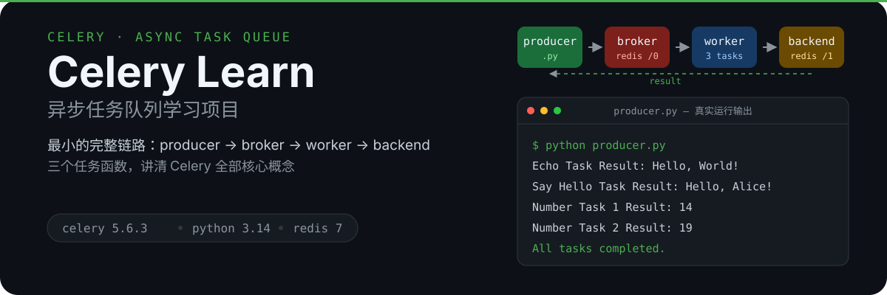
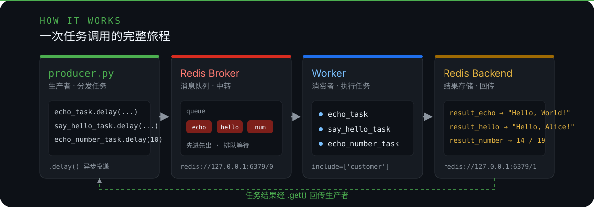

<p align="center">
  
</p>

# 🥬 Celery Learn

用最小的代码量讲清 Celery 异步任务队列的完整链路：**生产者分发 → Redis 中转 → worker 执行 → 结果回传**。


## ✨ 特性

- **最小完整链路**：producer → broker → worker → backend，一条龙跑通
- **3 个典型任务**：`echo_task`（回显消息）、`say_hello_task`（生成问候语）、`echo_number_task`（模拟耗时任务）
- **显式任务名**：每个任务用 `name=` 注册，broker 上的身份清晰可控
- **零依赖测试**：直接调用任务函数验证行为，不需要 redis 在线
- **一键基础设施**：docker compose 启动 redis，broker 与 backend 分离

## 🏗️ 架构

<p align="center">
  
</p>

| 概念 | 本项目中的角色 |
| --- | --- |
| **Task（任务）** | `customer.py` 中三个 `@app.task` 函数，是执行单元 |
| **Producer（生产者）** | `producer.py`，调用 `.delay()` 异步投递任务 |
| **Broker（消息代理）** | Redis `db 0`，存放待执行的任务队列 |
| **Worker（工作者）** | `celery -A celery_app worker`，从队列取任务并执行 |
| **Backend（结果后端）** | Redis `db 1`，保存任务返回值，供 `.get()` 取回 |

> 💡 **踩坑记录**：worker 必须通过 `include=['customer']` 才能发现任务模块——否则 `celery -A celery_app worker` 启动后 `[tasks]` 列表为空，所有任务都报 `NotRegistered`。

## 🚀 快速开始

```bash
# 1. 安装依赖（或直接使用仓库自带 .venv）
pip install celery redis

# 2. 启动 redis（docker compose）
docker compose -f docker-compose/docker-compose.yml up -d

# 3. 启动 worker（另开一个终端）
celery -A celery_app worker --loglevel=info
# 看到 [tasks] 下列出 echo_task / say_hello_task / echo_number_task 即成功

# 4. 运行生产者，分发任务并取回结果
python producer.py
```

## 🖥️ 预期输出

```
Echo Task Result: Hello, World!
Say Hello Task Result: Hello, Alice!
Waiting for tasks to complete...
Number Task 1 Result: 14
Number Task 2 Result: 19
All tasks completed.
```

## ✅ 测试

```bash
python -m unittest test_customer -v
```

```
test_echo_number_task_returns_final_number_processed ... ok
test_echo_task_returns_the_message ... ok
test_say_hello_task_returns_greeting_with_name ... ok

Ran 3 tests in 5.001s
OK
```

测试直接调用任务函数（不经 broker/worker），只断言外部行为，因此零外部依赖。

## 📁 项目结构

```
├── celery_app.py        # Celery 应用实例（broker / backend / include 配置）
├── customer.py          # 3 个任务的定义
├── producer.py          # 生产者：分发任务、取回结果
├── test_customer.py     # 行为测试（unittest）
├── docker-compose/
│   └── docker-compose.yml   # redis 基础设施
└── .gitignore
```

## 📄 说明

本项目是 Celery 学习 demo，代码刻意保持简单，方便对照 [Celery 官方文档](https://docs.celeryq.dev/) 理解每个概念。没有引入 Django、定时任务、优先级等进阶特性。
